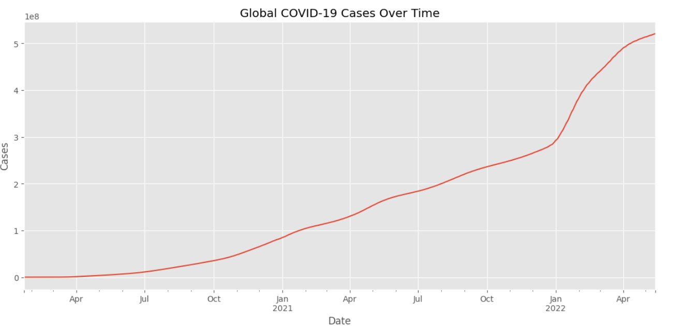
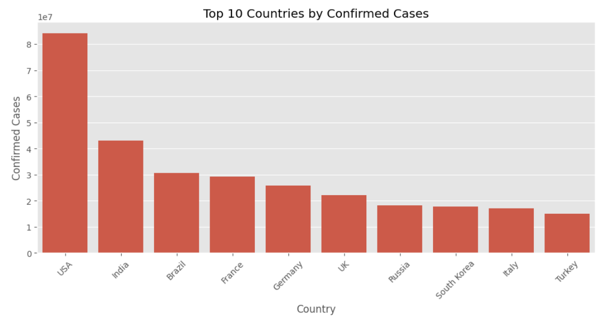
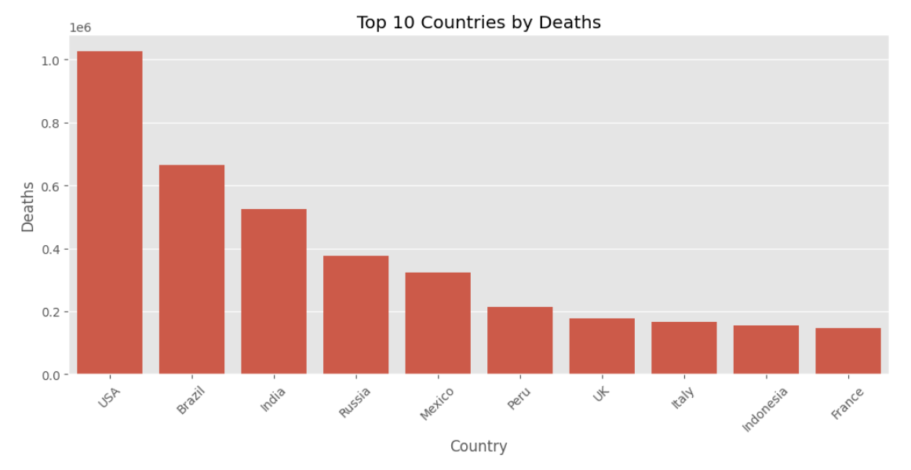
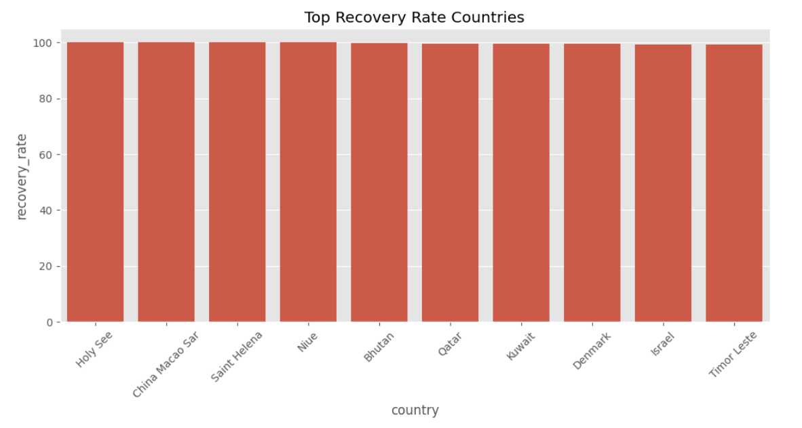
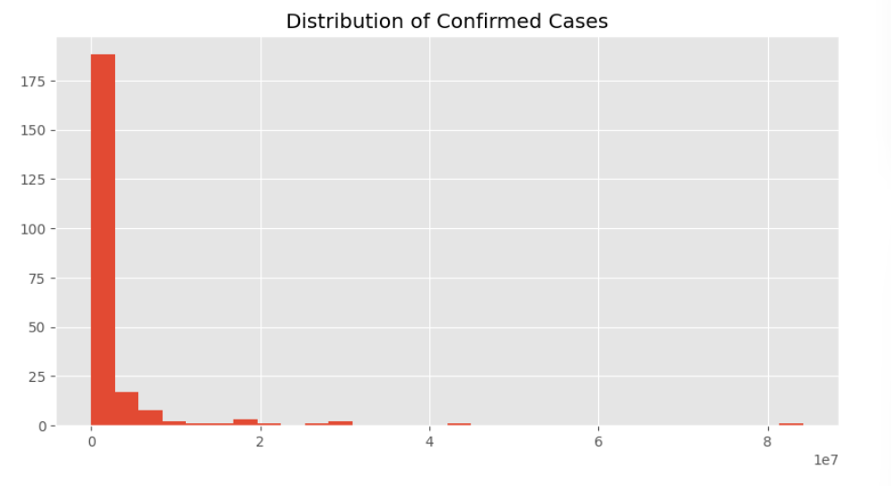
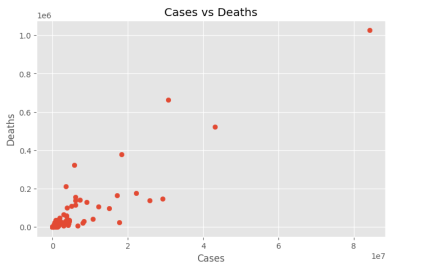
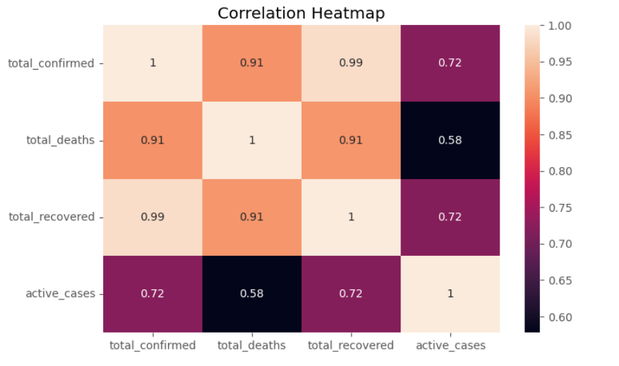
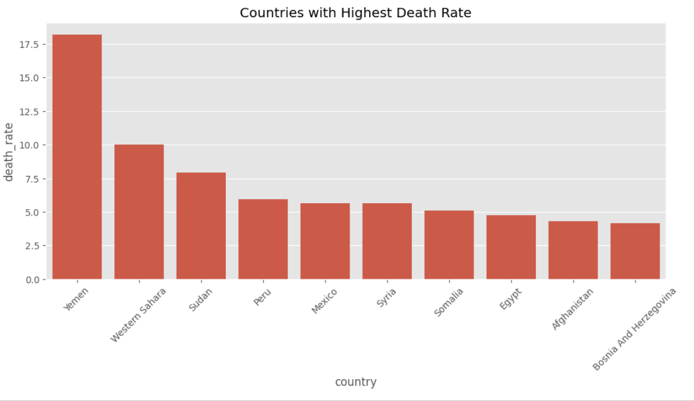

# 🌍 COVID-19 Global Impact Analysis Using Worldometer Datasets



## 📖 Project Overview

The COVID-19 pandemic had a profound impact on public health, economies, and societies worldwide. Understanding its spread and consequences requires more than raw numbers—it requires meaningful analysis and interpretation.

This project presents a comprehensive Exploratory Data Analysis (EDA) of global COVID-19 data using Worldometer datasets. By combining historical daily records with country-level summary statistics, the project uncovers key trends, compares country performance, evaluates recovery and mortality patterns, and provides actionable insights through data visualization.

The analysis demonstrates how data analytics can transform raw data into meaningful information that supports understanding of large-scale global events.

---

## 🎯 Project Objectives

- Analyze global COVID-19 trends over time.
- Identify countries with the highest confirmed cases and deaths.
- Compare recovery and mortality rates across countries.
- Study the progression of infections and deaths globally.
- Explore relationships among key COVID-19 indicators.
- Generate insights through exploratory data analysis and visualization.

---

## 📊 Datasets Used

### 1️⃣ Worldometer Daily COVID-19 Dataset

This dataset contains country-wise daily COVID-19 statistics and is used for trend analysis.

**Key Features**
- Date
- Country
- Cumulative Total Cases
- Daily New Cases
- Active Cases
- Cumulative Total Deaths
- Daily New Deaths

---

### 2️⃣ Worldometer Summary COVID-19 Dataset

This dataset provides country-level summary statistics and is used for comparative analysis.

**Key Features**
- Country
- Continent
- Total Confirmed Cases
- Total Deaths
- Total Recovered
- Active Cases
- Serious/Critical Cases
- Total Tests
- Population

---

## 🛠️ Technologies Used

- Python
- Pandas
- NumPy
- Matplotlib
- Seaborn
- Google Colab
- GitHub

---

## 🧹 Data Preprocessing

The following preprocessing steps were performed before analysis:

✔ Dataset inspection

✔ Missing value analysis

✔ Data type verification

✔ Date conversion

✔ Handling null and infinite values

✔ Feature engineering

---

## ⚙️ Feature Engineering

Two additional metrics were created to gain deeper insights:

### Recovery Rate

```text
Recovery Rate = (Total Recovered / Total Confirmed Cases) × 100
```

### Death Rate

```text
Death Rate = (Total Deaths / Total Confirmed Cases) × 100
```

These metrics help compare pandemic outcomes across countries.

---

## 🔍 Exploratory Data Analysis Questions

The project focuses on answering the following questions:

### 1. Which countries reported the highest number of confirmed COVID-19 cases?

### 2. Which countries experienced the highest cumulative deaths?

### 3. Which countries achieved the highest recovery rates?

### 4. How did global COVID-19 cases evolve over time?

### 5. How did global COVID-19 deaths change throughout the pandemic?

### 6. Which countries recorded the highest mortality rates? *(Bonus Analysis)*

---

# 📈 Key Visualizations

## Top 10 Countries by Confirmed Cases



---

## Top 10 Countries by Deaths



---

## Countries with Highest Recovery Rates



---

## Global COVID-19 Cases Over Time


---

## Global COVID-19 Deaths Over Time


---

## Distribution of Confirmed Cases



---

## Confirmed Cases vs Deaths



---

## Correlation Heatmap



---

## Countries with Highest Death Rates



---

## 💡 Key Insights

### Insight 1
A small number of countries contributed a significant proportion of total global COVID-19 cases.

### Insight 2
Countries with the highest infection counts generally reported the highest death counts, indicating a strong relationship between infections and mortality.

### Insight 3
Recovery rates varied considerably across countries, reflecting differences in healthcare systems and pandemic response strategies.

### Insight 4
Global infections increased rapidly during major outbreak periods, highlighting the contagious nature of the virus.

### Insight 5
Correlation analysis revealed strong positive relationships among confirmed cases, recoveries, and deaths.

---

## 🚀 Most Significant Finding

One of the most notable findings was the variation in recovery rates among countries. Several nations maintained high recovery percentages despite recording a large number of confirmed cases. This emphasizes the importance of healthcare infrastructure, testing capacity, and effective public health measures during a global health crisis.

---

## 📋 Project Outcome

This project successfully transformed raw COVID-19 datasets into meaningful insights through structured data analysis and visualization. By combining historical trend analysis with country-level comparative analysis, the project provides a comprehensive understanding of the pandemic's global impact.

The project demonstrates practical applications of:

- Data Cleaning
- Exploratory Data Analysis (EDA)
- Feature Engineering
- Statistical Visualization
- Insight Generation
- Data Storytelling

---

## 📂 Repository Structure

```text
COVID19-Global-Impact-Analysis
│
├── images
│   ├── top_10_cases.png
│   ├── top_10_deaths.png
│   ├── recovery_rate.png
│   ├── global_cases_trend.png
│   ├── global_deaths_trend.png
│   ├── cases_distribution.png
│   ├── cases_vs_deaths.png
│   ├── correlation_heatmap.png
│   └── death_rate_analysis.png
│
├── Covid19_Global_Impact_Analysis.ipynb
├── worldometer_coronavirus_daily_data.csv
├── worldometer_coronavirus_summary_data.csv
├── requirements.txt
└── README.md
```

---

## 🎓 Skills Demonstrated

- Data Analysis
- Data Cleaning
- Exploratory Data Analysis
- Data Visualization
- Statistical Interpretation
- Feature Engineering
- Analytical Thinking
- GitHub Documentation

---

## 👩‍💻 Author

**Varshitha**

AI & Machine Learning Internship Project

A comprehensive Exploratory Data Analysis project focused on understanding the global impact of COVID-19 through data-driven insights and visualization.

project completed as part of the AI & ML Internship Program through **Pluto Academy**
---

⭐ If you found this project useful, consider exploring the notebook and visualizations to gain deeper insights into global COVID-19 trends and patterns.
